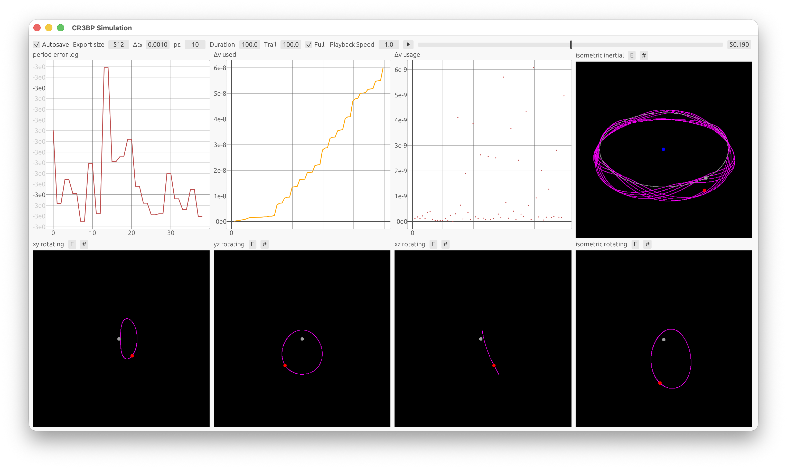

# Circular Restricted Three-Body Problem Simulation

This program simulates a satellite orbiting under the influence of gravity from the Earth and Moon. It was primarily created to study halo orbits. The satellite attempts to correct its unstable orbit at regular intervals.

The simulation uses variable-step-size Runge–Kutta–Fehlberg numerical integration to maximize simulation precision.

For more information, see the [paper](<Analyzing Methods for Unstable Halo Orbit Maintenance.pdf>).

```
cargo run --release
```



This simulation was created as part of my 2025 science fair project. The project placed 2nd at Florida State Science and Engineering Fair (SSEF) 2025.
